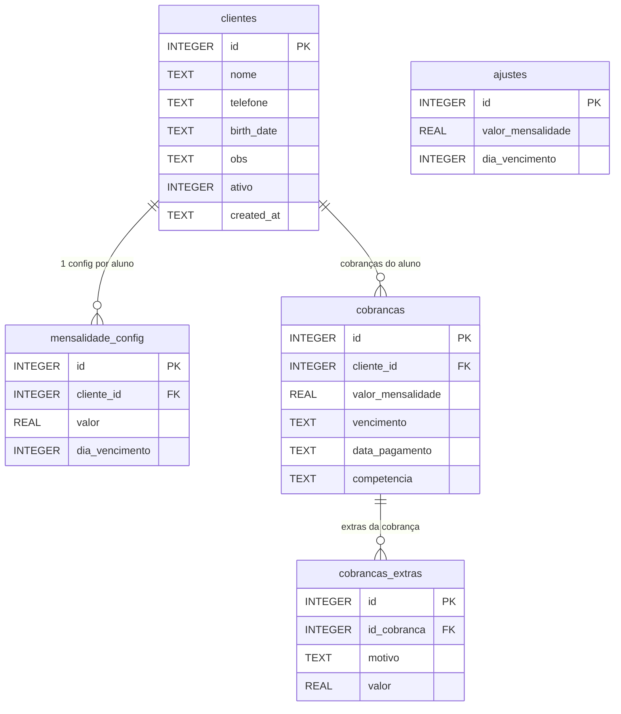

**obs:**

- Se houver valor em mensalidade_config, ignorar valor de ajustes para mensalidade do cliente;
- Se houver dia_vencimento em mensalidade config, ignorar valor de ajustes para gerar a mensalidade desse cliente



```SQL
PRAGMA foreign_keys = ON;

CREATE TABLE clientes (
  id         INTEGER PRIMARY KEY AUTOINCREMENT,
  nome       TEXT    NOT NULL,
  telefone   TEXT,
  birth_date TEXT,
  obs        TEXT,
  ativo      INTEGER NOT NULL DEFAULT 1,
  created_at TEXT    NOT NULL
);

CREATE TABLE ajustes (
  id                INTEGER PRIMARY KEY AUTOINCREMENT,
  valor_mensalidade REAL    NOT NULL,
  dia_vencimento    INTEGER NOT NULL
);

CREATE TABLE mensalidade_config (
  id             INTEGER PRIMARY KEY AUTOINCREMENT,
  cliente_id     INTEGER NOT NULL REFERENCES clientes(id),
  valor          REAL,
  dia_vencimento INTEGER
);

CREATE TABLE cobrancas (
  id                INTEGER PRIMARY KEY AUTOINCREMENT,
  cliente_id        INTEGER NOT NULL REFERENCES clientes(id),
  valor_mensalidade REAL    NOT NULL,
  vencimento        TEXT    NOT NULL,
  data_pagamento    TEXT,
  competencia       TEXT    NOT NULL
);

CREATE TABLE cobrancas_extras (
  id          INTEGER PRIMARY KEY AUTOINCREMENT,
  id_cobranca INTEGER NOT NULL REFERENCES cobrancas(id),
  motivo      TEXT    NOT NULL,
  valor       REAL    NOT NULL
);
```
